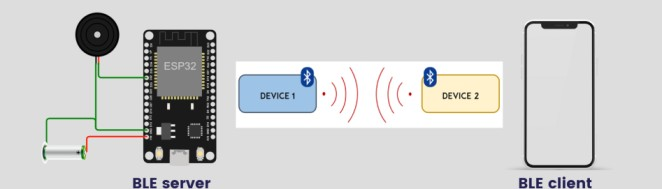

# BeakHen 

**BeakHen** is a Bluetooth-based location detector utilizing  a ESP32 microcontroller, specifically engineered for tracking easily misplaced items like car keys.

## Requirements
### Hardware 

- ESP32 development board
- LED
- Buzzer
- Resistors (as needed for LED and buzzer connections)
- Jumper wires

### Software

- Arduino IDE
- Required libraries (see `requirements.txt`)

## Circuit Diagram

## Setup Instructions

1. Connect the LED to GPIO 2 and the buzzer to GPIO 32 on the ESP32.
2. Install the Arduino IDE and required libraries.
3. Open the `BeakHen.ino` file in the Arduino IDE.
4. Select your ESP32 board and port in the Arduino IDE.
5. Upload the code to your ESP32.

Note: It is recommended to use Arduino IDE version 1.8 as later versions may contain bugs.

## Usage

After uploading the code, the ESP32 will create a BLE server named "ESP32-BLE". You can connect to this server using any BLE scanner app available in the Play Store or App Store. Once connected to the BLE server, you can send commands to control the device. The available commands are:

- Send "L1" to turn the LED on
- Send "L0" to turn the LED off
- Send "B1" to turn the buzzer on
- Send "B0" to turn the buzzer off

## Contributing

Contributions to this project are welcome. Please fork the repository and submit a pull request with your changes.

## License

This project is licensed under the MIT License - see the [LICENSE](LICENSE) file for details.